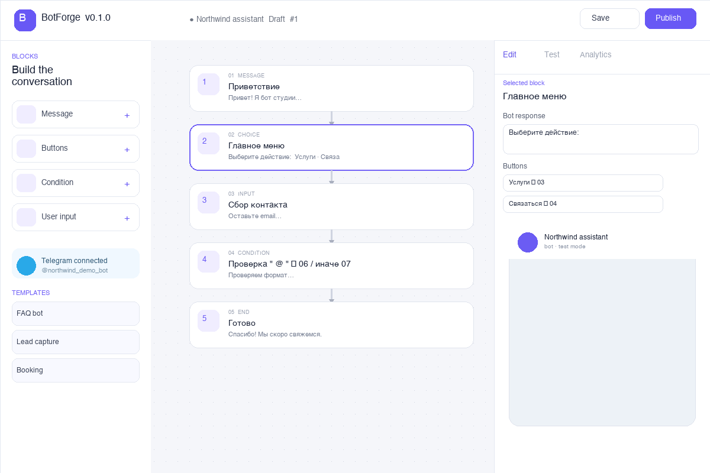

# BotForge

**Визуальный no-code конструктор Telegram-ботов.** Сценарии собираются из блоков, проверяются во встроенном симуляторе, публикуются в Telegram и анализируются в одном интерфейсе.

[English](README.md) · [Русский](README.ru.md)



## Возможности

- Визуальный редактор: сообщение, кнопки, ввод данных, условие и завершение
- Шаблоны FAQ, сбора заявок, записи и обратной связи
- Симулятор для проверки несохранённого сценария
- Переменные вида `{{name}}` для персональных ответов
- Отдельный Telegram-токен для каждого сценария
- Сохранение состояния диалога и защита от повторных Telegram updates
- Аналитика пользователей, сообщений и активности за семь дней
- Запуск через Docker Compose и проверки GitHub Actions

## Стек

| Часть | Технологии |
|---|---|
| Фронтенд | React 19, TypeScript, Vite, Lucide |
| API | FastAPI, Pydantic, асинхронный SQLAlchemy |
| База данных | PostgreSQL 17, JSONB |
| Интеграция | Telegram Bot API и webhooks |
| Запуск | Docker Compose, nginx, GitHub Actions |

## Быстрый запуск

Понадобятся Docker Desktop и Docker Compose.

```bash
cp .env.example .env
docker compose up --build
```

- Редактор: <http://localhost:3000>
- Обзор API: <http://localhost:8000>
- Документация API: <http://localhost:8000/docs>

## Подключение Telegram

1. Создайте бота через [@BotFather](https://t.me/BotFather) и скопируйте токен.
2. Сохраните сценарий, откройте карточку **Telegram**, вставьте токен и опубликуйте его.
3. Откройте API по публичному HTTPS-адресу и установите webhook:

```bash
curl -X POST "https://api.telegram.org/bot<BOT_TOKEN>/setWebhook" \
  -H "Content-Type: application/json" \
  -d '{"url":"https://<PUBLIC_HOST>/api/telegram/webhook/<WORKFLOW_ID>","secret_token":"<WEBHOOK_SECRET>"}'
```

Укажите такой же секрет в `.env` как `TELEGRAM_WEBHOOK_SECRET`. Реальные токены и `.env` нельзя добавлять в Git.

## Как работает сценарий

Сценарий хранится в PostgreSQL как JSONB-граф. Движок `run_step()` выполняет одинаковые правила в симуляторе и Telegram. Блок ввода сохраняет ответ в переменную, а следующий блок выводит её через `{{variable}}`. Для каждого Telegram-пользователя база хранит текущий блок и состояние диалога.

API возвращает только признак `has_token`, но не сохранённый токен. Перед публикацией проверяются сломанные переходы и незаполненные блоки выбора или условия.

## Проверка проекта

```bash
cd backend && pytest -q
cd frontend && npm run build
```

GitHub Actions запускает обе проверки при каждом push и pull request.

## Ограничения текущей версии

BotForge рассчитан на одного владельца и портфолио-демо. В management API пока нет аккаунтов, поэтому публичное размещение требует закрытой сети или внешнего прокси с авторизацией. Для полноценного SaaS также нужны разграничение доступа, шифрование токенов в базе, rate limiting и фоновая очередь с повторными отправками в Telegram.

## Лицензия

Репозиторий предназначен для портфолио и обучения.
